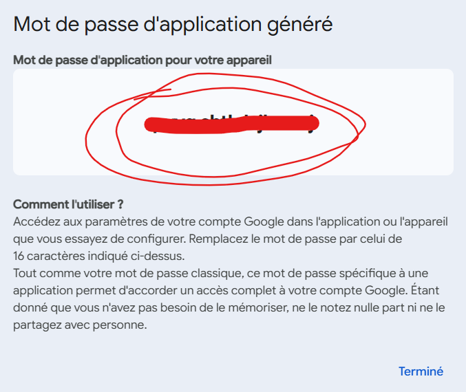
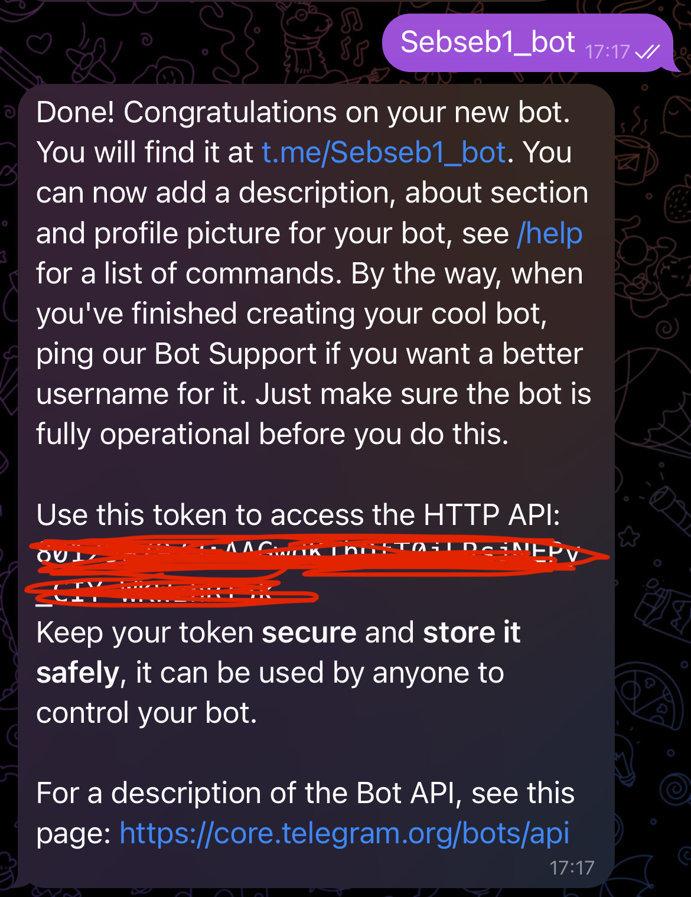

# AI Job Assistant
An AI that supports you throughout your job application journey.

## Installation and prerequisites 
- **Python3** in version 3.10.12
- An API key for **OpenAI**, **Gemini**, or **NVIDIA NIM** (this one is used for the project)

## Configuring the environnement
Clone the repo from Github:
```bash
git clone https://github.com/Sebastien2402/AI_Assistant_1.git
```
Create and activate the virtual environnement (recommended):
```bash
python3 -m venv venv 
```
```bash
source venv/bin/activate
```
Install required librairies:
```bash
pip install -r requirements.txt
```
Make sure to fill in the .env file. You need to create an account on OpenAI, Gemini, or NVIDIA NIM to obtain your API keys.
```bash
NVIDIA_API_KEY='YOUR NVIDIA NIM API KEY'
IMAP_SERVER=imap.gmail.com (Done, no key needed)
EMAIL_USER='YOUR EMAIL' (Your Gmail)
EMAIL_PASS='YOUR EMAIL (APP) PASSWORD' (To get the key, instructions in the next step)
TELEGRAM_BOT_TOKEN='YOUR TELEGRAM BOT TOKEN' (To get the key, instructions in the next step)
TELEGRAM_CHAT_ID='YOUR TELEGRAM CHAT ID' (To get the key, instructions in the next step)
```
## How to launch AI_Assistant
In our case, we will be using Gmail emails
###Get your EMAIL_PASS Key
Navigate to: https://myaccount.google.com/
Search for App Passwords.
Then, name your app to generate the EMAIL_PASS key, which will then be displayed on your screen. Don't close it !
Important: Copy and save this key immediately, as it will not be shown again.
Your EMAIL_PASS key should be shown as below:


###Get your TELEGRAM_BOT_TOKEN
First, please download on your mobile phone the Telegram app, available on Android and IOS.
Once on the Telegram app downloaded, look for @BotFather, click on it or START.
Run the following command:
```bash
/newbot
```
Enter the bot a name, that finish with "bot", like : my_AI_assistant_bot.
Your token should be shown as below: 

###Get your TELEGRAM_CHAT_ID
Your Telegram bot should now be active. Send /start in the chat; this is required for the next step.
In a browser, enter the following link: https://api.telegram.org/YOURTELEGRAMBOTTOKEN/getUpdates 
Example: https://api.telegram.org/bot123456789:AAxxxxxxx/getUpdates
Your screen should now match this:

Your TELEGRAM_CHAT_ID is : "id":'HERE'.

##Launching
Verify your environment: Ensure Python 3.10.12 is active and requirements are met.
```bash
python3 Backend/mail_agent.py 
```
## Contributors
- Sebastien Nguyen
- Jennifer Chen